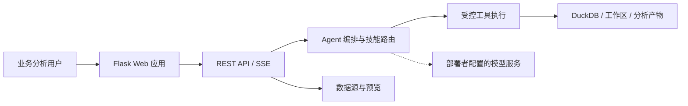

# 数探｜智能数据分析 Agent

<p align="center">
  
</p>

<p align="center"><strong>把 Excel、数据库和业务 API 变成可追问、可验证、可交付的分析结果</strong></p>

<p align="center">
  <a href="./README_EN.md">English</a> ·
  <a href="./docs/数探-Data-Analysis-Agent-PRD-精简版.md">投递精简 PRD</a> ·
  <a href="./docs/数探-Data-Analysis-Agent-PRD.md">完整 PRD</a> ·
  <a href="./DEMO_GUIDE.md">5 分钟体验</a> ·
  <a href="./DEPLOYMENT.md">部署指南</a>
</p>

## 项目简介

数探是面向业务分析的对话式 AI 数据工作台。用户接入文件或数据源后，用自然语言提出问题；系统通过受控工具执行查询、清洗、统计和图表生成，并将数据范围、工具过程和结果放在同一会话中。

它解决的不是“让模型回答一个问题”，而是让不会 SQL 的业务人员完成一次可核验的数据分析：**添加数据 → 确认字段 → 提出问题 → 真实执行 → 查看依据 → 继续追问**。


## 核心能力

| 能力 | 说明 |
| --- | --- |
| 对话式分析 | 使用中文或英文提出经营问题，支持连续追问、流式结果、停止与有限重试。 |
| 多源数据接入 | Excel/CSV、SQL 数据库、Google Sheets、HTTP API、本地工作区和示例数据。 |
| 可信执行 | 数据范围可见；SQL 只读校验；查询、统计、清洗和图表由工具执行。 |
| 分析与交付 | 数据质量、聚合、趋势、建模、预测、图表、Excel、报告、PPT 和 Dashboard。 |
| 分析资产复用 | 历史会话、个人知识库、指标口径、业务规则和个人偏好。 |
| 长任务管理 | 解析、导出和长时分析可进入后台任务，支持查看状态、取消、恢复和下载。 |

## 为什么结果可核验


- 大模型负责理解问题、组织步骤和解释结果；工具负责实际查询、计算与验证。
- 数值结论对应数据范围和工具结果；工具失败、数据不足或口径不清时展示真实状态。
- 个人知识库沉淀指标定义、业务规则和背景知识，避免每次重新解释口径。

## 快速开始

环境：Python 3.10+；修改前端时另需 Node.js 20.19+ 与 pnpm。

```powershell
git clone https://github.com/qrwuu/data-analysis-agent.git
cd data-analysis-agent

python -m venv .venv
.\.venv\Scripts\Activate.ps1
python -m pip install -r requirements.txt

Copy-Item .env.example .env
python app.py
```

打开 <http://localhost:5001/>。完整部署、Docker 与生产配置见 [DEPLOYMENT.md](./DEPLOYMENT.md)。

## 模型服务配置

部署数探时，在服务端的 `.env` 文件中配置兼容的模型服务、模型名称和访问密钥，再启动应用。模型配置仅在部署环境生效，不会暴露给浏览器；用户无需在页面中填写模型地址或密钥。

## 文档与验证

| 文档 | 用途 |
| --- | --- |
| [投递精简 PRD](./docs/数探-Data-Analysis-Agent-PRD-精简版.md) | 10–15 页作品集阅读版本。 |
| [完整 PRD](./docs/数探-Data-Analysis-Agent-PRD.md) | 完整需求、验收、风险与评测口径。 |
| [架构说明](./ARCHITECTURE.md) | 系统模块、数据流与技术架构。 |
| [离线评测](./evals/README.md) | 冻结数据集、Prompt A/B、指标与复现实验。 |
| [安全策略](./SECURITY.md) | SQL、路径、浏览器和凭据安全基线。 |

```bash
python -m unittest discover -s Test -p "test_*.py" -v
```

## 数据与安全

- 模型与外部数据源凭据仅在部署环境配置。
- SQL 使用 AST 级只读校验，阻断写入和高风险语句。
- 工作区屏蔽 `.env`、`.git`、`.ssh`、私钥等敏感路径。
- 浏览器启用 CSP、同源写保护、内容类型保护和限制性权限策略。

## 界面能力

- **智能分析**：连续对话、流式回复、停止生成、失败重试和焦点模式。
- **数据预览**：按数据源和数据表浏览字段、样例行及当前分析上下文。
- **分析工具**：搜索并显式选择分析技能，也可根据自然语言自动匹配。
- **斜杠命令**：使用 `/data`、`/skills`、`/jobs`、`/knowledge`、`/sessions`、`/compact` 等命令快速操作。
- **结果交互**：复制 Markdown、下载图表、查看工具执行状态，并基于现有结果继续追问。
- **应用设置**：切换深浅主题与中英文界面，并管理助手偏好和个人工作习惯。
- **工作目录**：挂载本地项目目录，选择只读或可编辑权限，让 Agent 在明确边界内读取数据和生成产物。
- **MCP 与 Teams**：连接外部 MCP 服务，并通过可配置的轻量团队拆解复杂分析任务。

## 使用方法

1. 点击输入框左侧的「添加数据」，上传文件或连接数据源。
2. 打开「数据预览」，检查表名、字段和样例数据；多表场景下选择本轮要分析的表。
3. 直接描述问题，或从「分析工具」中指定 SQL、图表、回归、聚类、时间序列等方法。
4. 在回答中核对查询结果、图表和工具执行过程，并继续追问。
5. 通过产物卡片下载 Excel、报告、PPT 或仪表盘；需要长期保留时保存分析会话。

```text
按地区汇总销售额，并生成从高到低的柱状图。
检查这份数据的缺失值、重复记录和异常值。
比较最近 12 个月的收入趋势，指出变化最大的月份。
对客户做 K-Means 分群，解释每一组的主要特征。
把本次分析整理成一份面向管理层的报告。
```

无需准备真实数据也可以体验：在「添加数据」菜单选择「使用示例数据」。完整演示路径见 [DEMO_GUIDE.md](./DEMO_GUIDE.md)。

## 支持的数据入口

| 数据源 | 配置方式 |
| --- | --- |
| Excel / CSV | 选择或拖拽 `.xlsx`、`.xls`、`.csv` 文件。 |
| SQL 数据库 | 提供 SQLAlchemy 连接字符串，支持 MySQL、PostgreSQL、SQLite、SQL Server 等。 |
| Google Sheets | 提供表格 URL / ID 与服务账号 JSON，并将表格共享给该服务账号。 |
| HTTP API | 提供返回表格型 JSON 数据的 URL，可配置 Bearer Token 或 `X-API-Key`。 |
| 本地工作目录 | 挂载目录并设置只读或可编辑权限，直接使用其中的数据文件。 |

## 内置分析能力

项目内置 22 个可发现技能：

- 数据理解与清洗：数据画像、缺失值处理、截尾、缩尾与异常值处理。
- 查询与可视化：安全 SQL 查询、自动选图和多类型图表生成。
- 统计与建模：十分位分析、变量筛选、线性回归、逻辑回归、决策树、K-Means。
- 时间序列：ARIMA、SARIMA、Prophet、VAR、GRU。
- 业务交付：漏斗分析、数据导出、报告、PPT 和交互式仪表盘。

## 技术架构



- **前端**：Flask 模板、模块化原生 JavaScript、Vue 渐进式交互岛、Vite 构建。
- **服务层**：Flask、Waitress、SSE 流式事件、后台任务和会话状态管理。
- **Agent 层**：工具注册、技能路由、命令系统、重试、上下文压缩和多 Agent 协作。
- **数据层**：pandas、DuckDB、SQLAlchemy、sqlglot、openpyxl 和多数据源适配器。
- **输出层**：Plotly / ECharts、Excel、Word、PDF、PPT 与独立 Dashboard。

详细设计见 [ARCHITECTURE.md](./ARCHITECTURE.md)。

## 项目结构

`agent/` 负责 Agent 编排、工具、技能与上下文；`api/` 提供会话、数据源、模型、任务、知识库与导出接口；`data/` 负责数据源适配和持久化；`frontend/`、`static/` 与 `templates/` 提供界面资源；`Function/` 实现分析、清洗、图表和输出；`Test/` 提供回归测试；`demo_data/` 与 `data_templates/` 提供演示和模板数据。

## Docker 部署

```bash
cp .env.example .env
cp Caddyfile.example Caddyfile
docker compose up -d --build
```

`compose.yaml` 将运行数据持久化到 `runtime-data/`，并通过 Caddy 提供 HTTPS 和 SSE 反向代理。生产配置与备份方式见 [DEPLOYMENT.md](./DEPLOYMENT.md)。

## 开发与验证

```bash
# Python 核心回归
python -m unittest Test.test_api_smoke Test.test_validate Test.test_ecommerce_metrics

# 前端质量检查
pnpm install --frozen-lockfile
pnpm quality
```

项目包含接口、数据源、Agent 工具、任务队列、知识库、鉴权、安全策略、跨平台运行和前端交互等测试。
