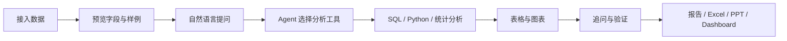
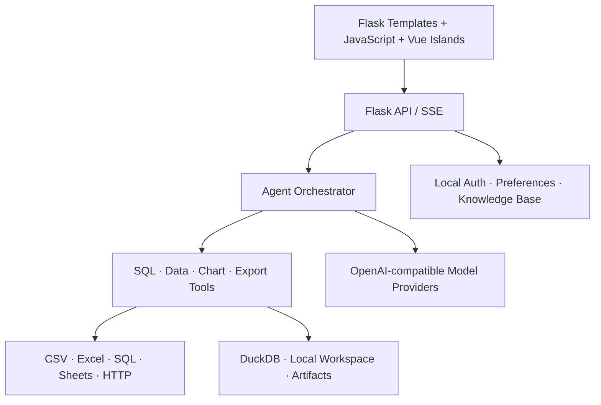

# 数探 Agent · DataScout Agent

<p align="center">
  
</p>

<p align="center">
  <strong>把 Excel、数据库和业务 API 变成可追问、可验证、可交付的分析结果</strong>
</p>

<p align="center">
  <a href="./README_EN.md">English</a> ·
  <a href="#快速开始">快速开始</a> ·
  <a href="./DEMO_GUIDE.md">5 分钟体验</a> ·
  <a href="./ARCHITECTURE.md">系统架构</a> ·
  <a href="./DEPLOYMENT.md">部署指南</a>
</p>

<p align="center">
  
  
  
  
</p>

## 这是什么

数探 Agent 是一个面向业务分析的 AI 数据工作台。用户可以接入 Excel / CSV、SQL 数据库、Google Sheets 或 HTTP API，用自然语言提出问题，并在同一界面中完成数据预览、查询、统计分析、图表生成、结论追问和分析产物导出。

它把一次分析拆成可观察的步骤：数据从哪里来、AI 调用了什么工具、查询得到了什么结果、图表基于哪些字段生成，都能在对话中直接核对。对需要稳定口径的场景，项目还提供确定性指标计算、数据质量检查和规则诊断能力，避免让模型代替程序做数值计算。

## 产品亮点

| 能力 | 用户获得什么 |
| --- | --- |
| 多源数据接入 | 上传 Excel / CSV，或连接 SQL、Google Sheets、HTTP API；一个会话可管理多个数据源 |
| 对话式分析 | 用中文或英文直接提问，流式查看推理状态、工具执行、表格、图表与结论 |
| 可控分析工具 | 22 个内置技能覆盖 SQL、清洗、回归、聚类、时间序列、图表、报告、PPT 和仪表盘 |
| 数据上下文可见 | 在数据预览中检查表、字段和样例行，并明确本轮分析使用的数据表 |
| 可交付结果 | 导出数据表、Excel、分析报告、PPT、图表和可交互仪表盘 |
| 长任务管理 | 耗时操作进入后台任务队列，可查看进度、取消任务、恢复结果和下载产物 |
| 知识与口径沉淀 | 管理指标定义、业务规则、背景知识和导入文件，让分析语言保持一致 |
| 会话与偏好 | 保存、恢复、重命名历史分析；登录后持久化个人偏好与知识内容 |
| 本地优先 | 数据解析、查询、产物和账号数据默认保存在本机指定目录，密钥不进入代码仓库 |

## 一次分析如何完成



## 界面能力

- **智能分析**：连续对话、流式回复、停止生成、失败重试、建议追问和焦点模式。
- **数据预览**：按数据源和数据表浏览字段、样例行及当前分析上下文。
- **分析工具**：搜索并显式选择分析技能，也可让系统根据自然语言自动匹配。
- **斜杠命令**：使用 `/data`、`/skills`、`/jobs`、`/knowledge`、`/sessions`、`/compact` 等命令快速操作。
- **结果交互**：复制 Markdown、下载图表、查看工具执行状态，并基于现有结果继续追问。
- **应用设置**：配置模型提供商、自定义兼容接口、深浅主题、中英文界面和助手偏好。
- **工作目录**：挂载本地项目目录，选择只读或可编辑权限，让 Agent 在明确边界内读取数据和生成产物。
- **MCP 与 Teams**：连接外部 MCP 服务，并通过可配置的轻量团队拆解复杂分析任务。

## 快速开始

### 环境要求

- Python 3.10+
- Windows、macOS 或 Linux
- 至少一个 OpenAI 兼容模型服务，用于 AI 对话分析
- Node.js 20.19+ 与 pnpm 仅在修改或重新构建前端时需要

### Windows

```powershell
git clone https://github.com/uuuuuu11/data-analysis-agent.git
cd data-analysis-agent

python -m venv .venv
.\.venv\Scripts\Activate.ps1
python -m pip install --upgrade pip
python -m pip install -r requirements.txt

Copy-Item .env.example .env
python app.py
```

### macOS / Linux

```bash
git clone https://github.com/uuuuuu11/data-analysis-agent.git
cd data-analysis-agent

python3 -m venv .venv
source .venv/bin/activate
python -m pip install --upgrade pip
python -m pip install -r requirements.txt

cp .env.example .env
python app.py
```

打开 <http://localhost:5001/>。健康检查地址为 <http://localhost:5001/api/health>。

## 配置模型

推荐启动后在「应用设置 → 模型」中配置提供商、Base URL、Model ID 和 API Key。也可以编辑本地 `.env`：

```dotenv
OPENAI_API_KEY=your-key
# 或使用兼容服务
DEEPSEEK_API_KEY=your-key
ANTHROPIC_AUTH_TOKEN=your-key
```

`.env`、本地模型配置、上传文件、运行日志和分析产物均已加入忽略规则，不会被 Git 提交。

## 使用方法

1. 点击输入框左侧的「添加数据」，上传文件或连接数据源。
2. 打开「数据预览」，检查表名、字段和样例数据；多表场景下选择本轮要分析的表。
3. 在模型设置中选择已配置模型。
4. 直接描述问题，或从「分析工具」中指定 SQL、图表、回归、聚类、时间序列等方法。
5. 在回答中核对查询结果、图表和工具执行过程，并继续追问。
6. 通过产物卡片下载 Excel、报告、PPT 或仪表盘；需要长期保留时保存分析会话。

可以从这些问题开始：

```text
按地区汇总销售额，并生成从高到低的柱状图。
检查这份数据的缺失值、重复记录和异常值。
比较最近 12 个月的收入趋势，指出变化最大的月份。
对客户做 K-Means 分群，解释每一组的主要特征。
把本次分析整理成一份面向管理层的报告。
```

无需准备真实数据也可以体验：在「添加数据」菜单选择「使用示例数据」。完整演示路径见 [DEMO_GUIDE.md](./DEMO_GUIDE.md)。

## 支持的数据入口

| 数据源 | 配置方式 |
| --- | --- |
| Excel / CSV | 选择或拖拽 `.xlsx`、`.xls`、`.csv` 文件 |
| SQL 数据库 | 提供 SQLAlchemy 连接字符串，支持 MySQL、PostgreSQL、SQLite、SQL Server 等 |
| Google Sheets | 提供表格 URL / ID 与服务账号 JSON，并将表格共享给该服务账号 |
| HTTP API | 提供返回表格型 JSON 数据的 URL，可配置 Bearer Token 或 `X-API-Key` |
| 本地工作目录 | 挂载目录并设置只读或可编辑权限，直接使用其中的数据文件 |

## 内置分析能力

项目内置 22 个可发现技能：

- 数据理解与清洗：数据画像、缺失值处理、截尾、缩尾与异常值处理。
- 查询与可视化：安全 SQL 查询、自动选图和多类型图表生成。
- 统计与建模：十分位分析、变量筛选、线性回归、逻辑回归、决策树、K-Means。
- 时间序列：ARIMA、SARIMA、Prophet、VAR、GRU。
- 业务交付：漏斗分析、数据导出、报告、PPT 和交互式仪表盘。

## 技术架构



- **前端**：Flask 模板、模块化原生 JavaScript、Vue 渐进式交互岛、Vite 构建。
- **服务层**：Flask、Waitress、SSE 流式事件、后台任务和会话状态管理。
- **Agent 层**：工具注册、技能路由、命令系统、重试、上下文压缩和多 Agent 协作。
- **数据层**：pandas、DuckDB、SQLAlchemy、sqlglot、openpyxl 和多数据源适配器。
- **输出层**：Plotly / ECharts、Excel、Word、PDF、PPT 与独立 Dashboard。

详细设计见 [ARCHITECTURE.md](./ARCHITECTURE.md)。

## 项目结构

```text
agent/            Agent 编排、工具、技能、命令与上下文管理
api/              会话、数据源、模型、任务、知识库与导出 API
data/             数据源适配、工作区、会话和持久化
frontend/         前端源代码
static/           可直接运行的浏览器资源与构建产物
templates/        主工作台与仪表盘页面
Function/         分析、清洗、图表和输出实现
skills/           内置分析技能说明
Test/             单元测试、接口测试和安全回归测试
demo_data/        可直接体验的匿名示例数据
data_templates/   订单、流量与广告数据模板
```

## Docker 部署

```bash
cp .env.example .env
cp Caddyfile.example Caddyfile
# 编辑 Caddyfile 中的域名和访问凭据
docker compose up -d --build
```

`compose.yaml` 将运行数据持久化到 `runtime-data/`，并通过 Caddy 提供 HTTPS 和 SSE 反向代理。生产配置与备份方式见 [DEPLOYMENT.md](./DEPLOYMENT.md)。

## 开发与验证

```bash
# Python 核心回归
python -m unittest Test.test_api_smoke Test.test_validate Test.test_ecommerce_metrics

# 前端质量检查
pnpm install --frozen-lockfile
pnpm quality
```

项目包含接口、数据源、Agent 工具、任务队列、知识库、鉴权、安全策略、跨平台运行和前端交互等测试。

## 数据与安全

- 密钥仅通过本地配置或环境变量读取，不写入前端和仓库。
- SQL 查询使用 AST 级只读校验，阻止写入型语句进入分析流程。
- 工作目录会屏蔽 `.env`、`.git`、`.ssh`、私钥等敏感路径。
- 页面启用 CSP、同源写保护、内容类型保护和严格的浏览器权限策略。
- 使用外部模型时，完成回答所需的提示词、表结构和相关数据会发送到所选模型服务；请按组织的数据政策配置提供商。

安全报告方式见 [SECURITY.md](./SECURITY.md)。

## 开源归属与许可

本项目基于 [Zafer-Liu/Data-Analysis-Agent](https://github.com/Zafer-Liu/Data-Analysis-Agent) 进行非商业二次开发，并在交互体验、工程结构、数据工作流、评测与部署方面进行了产品化扩展。原作者归属和许可证信息保留在 [LICENSE](./LICENSE) 中。

项目采用 **CC BY-NC 4.0** 许可，仅允许署名后的学习、研究和非商业使用。商业使用前请获得原著作权人的书面授权。
