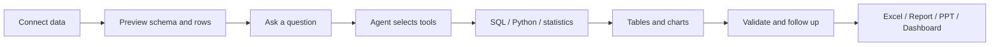
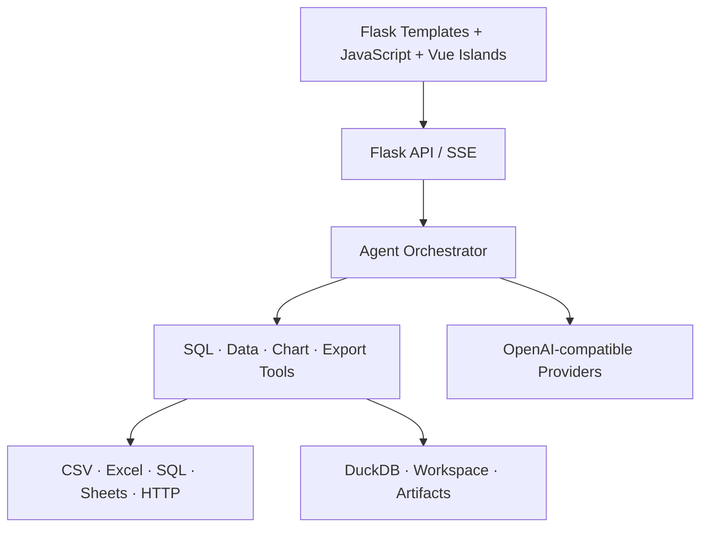

# DataScout Agent · AI Data Analysis Workspace

<p align="center">
  
</p>

<p align="center">
  <strong>Turn spreadsheets, databases, and business APIs into traceable analysis and reusable deliverables.</strong>
</p>

<p align="center">
  <a href="./README.md">中文</a> ·
  <a href="#quick-start">Quick Start</a> ·
  <a href="./ARCHITECTURE.md">Architecture</a> ·
  <a href="./DEPLOYMENT.md">Deployment</a>
</p>

## What it is

DataScout Agent is a conversational AI workspace for business data analysis. Connect Excel / CSV files, SQL databases, Google Sheets, HTTP APIs, or a local workspace; ask questions in natural language; then inspect the queries, tool execution, tables, charts, and conclusions in one interface.

The system keeps analytical work observable. Users can see which source is active, which tool is running, what data supports a result, and which artifact was produced. Deterministic metric, data-quality, and rule engines are available when calculations must remain independent from the language model.

## Highlights

| Capability | Product value |
| --- | --- |
| Multi-source context | Analyze files, databases, online sheets, APIs, and local workspace data in one session |
| Streaming AI analysis | Follow tool activity, tables, charts, reasoning status, retries, and follow-up questions |
| 22 built-in skills | SQL, cleaning, regression, clustering, forecasting, visualization, reports, PowerPoint, and dashboards |
| Visible data scope | Preview schemas and rows, then explicitly select the tables used by the current turn |
| Deliverable outputs | Export datasets, Excel workbooks, reports, presentations, charts, and interactive dashboards |
| Background jobs | Monitor progress, cancel long-running operations, recover results, and download artifacts |
| Business knowledge | Maintain metric definitions, business rules, context notes, and imported knowledge files |
| Local-first storage | Keep uploads, sessions, credentials, and generated artifacts outside the repository |

## User flow



## Quick start

Requirements: Python 3.10+ and an OpenAI-compatible model provider. Node.js is only required when rebuilding the frontend.

```bash
git clone https://github.com/uuuuuu11/data-analysis-agent.git
cd data-analysis-agent

python -m venv .venv
# Windows: .venv\Scripts\activate
# macOS / Linux: source .venv/bin/activate

python -m pip install --upgrade pip
python -m pip install -r requirements.txt
cp .env.example .env        # Windows PowerShell: Copy-Item .env.example .env
python app.py
```

Open <http://localhost:5001/>. The health endpoint is <http://localhost:5001/api/health>.

Configure a provider in **Application Settings → Models**, or add a key to the local `.env` file:

```dotenv
OPENAI_API_KEY=your-key
DEEPSEEK_API_KEY=your-key
ANTHROPIC_AUTH_TOKEN=your-key
```

## How to use it

1. Select **Add data** and upload a file or connect a source.
2. Open **Data Preview** to inspect schemas, sample rows, and active tables.
3. Select a configured model.
4. Ask a question directly or choose an explicit analysis skill.
5. Validate tool activity, tables, and charts, then continue with follow-up questions.
6. Download the generated artifact or save the analysis session.

Example questions:

```text
Summarize revenue by region and create a descending bar chart.
Check this dataset for missing values, duplicates, and outliers.
Compare the last 12 months and explain the largest changes.
Cluster customers with K-Means and describe each segment.
Turn this analysis into an executive report.
```

The **Use sample data** action provides an immediate product walkthrough without private data.

## Data connectors

- Excel / CSV (`.xlsx`, `.xls`, `.csv`)
- SQLAlchemy databases, including MySQL, PostgreSQL, SQLite, and SQL Server
- Google Sheets with a service account
- HTTP APIs with no auth, Bearer Token, or `X-API-Key`
- Local workspaces with explicit read-only or read/write permission

## Architecture



The frontend uses Flask templates, modular JavaScript, progressive Vue islands, and Vite. The backend combines Flask, Waitress, pandas, DuckDB, SQLAlchemy, sqlglot, background jobs, local authentication, and structured Agent tooling. See [ARCHITECTURE.md](./ARCHITECTURE.md) for details.

## Docker

```bash
cp .env.example .env
cp Caddyfile.example Caddyfile
docker compose up -d --build
```

Runtime data is persisted in `runtime-data/`. See [DEPLOYMENT.md](./DEPLOYMENT.md) for HTTPS, backup, and operations guidance.

## Verification

```bash
python -m unittest Test.test_api_smoke Test.test_validate Test.test_ecommerce_metrics
pnpm install --frozen-lockfile
pnpm quality
```

## Security and privacy

Secrets are loaded from local configuration, SQL is guarded by AST-level read-only validation, sensitive workspace paths are blocked, and browser responses use restrictive security headers. When an external model is selected, the context required for the answer is sent to that provider; choose providers according to your data policy.

See [SECURITY.md](./SECURITY.md) for responsible disclosure.

## Attribution and license

This repository is a non-commercial derivative of [Zafer-Liu/Data-Analysis-Agent](https://github.com/Zafer-Liu/Data-Analysis-Agent), with additional product, interaction, workflow, evaluation, and deployment engineering. Original attribution is preserved in [LICENSE](./LICENSE).

Licensed under **CC BY-NC 4.0** for attributed learning, research, and non-commercial use. Commercial use requires written permission from the original copyright holder.
